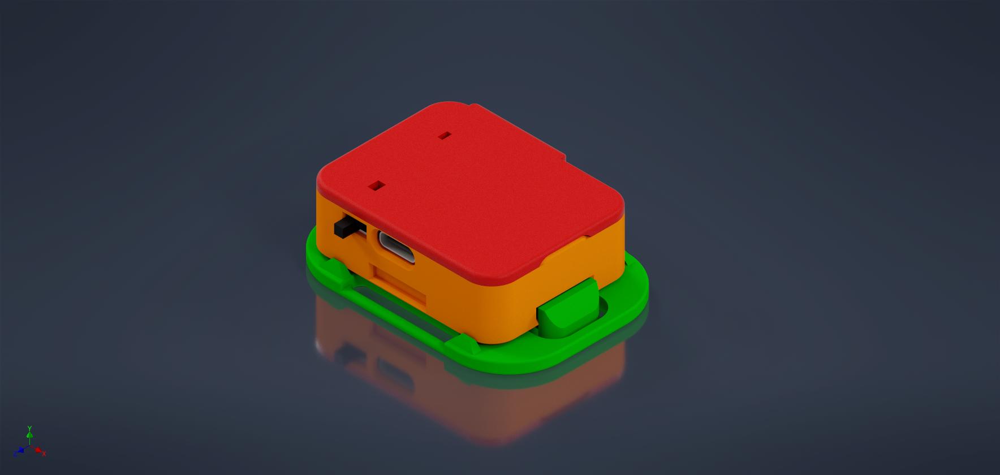
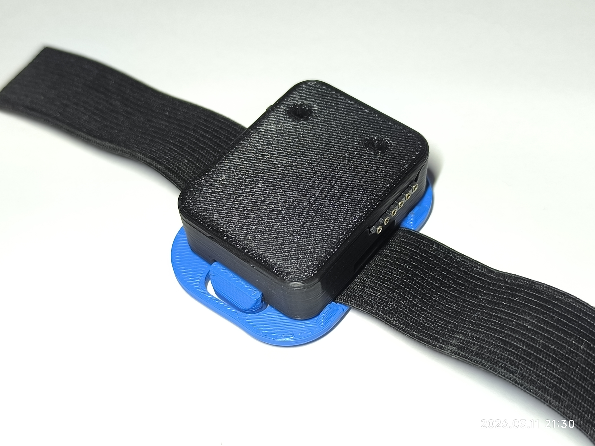

# Tracker Mainboard

These images show version **A (external flash / 6 pins)** of the main board (not CH340). The PCB is the same in both cases; only the charging/flash connection section and the board width differ.

| Assembly | Component view | Other view |
|---|---|---|
|  |  |  |

# WindSlimeVR Tracker Hardware

Hardware development and system design for **WindSlimeVR**, a custom full-body tracking solution for VR environments.

This repository showcases the electronic and mechanical development of the tracking devices, including PCB design, sensor modules, flashing tools, and auxiliary expansion boards.

⚠️ This repository is intended for **portfolio and documentation purposes only**. Design files and manufacturing files are not publicly distributed.

---

# Overview

WindSlimeVR trackers are compact embedded devices designed for **full-body motion tracking in virtual reality**.  
The project focuses on efficient hardware design, modularity, and ease of integration with VR tracking systems.

Key characteristics:

- Custom PCB hardware
- IMU-based motion tracking
- Embedded microcontroller architecture
- Modular tracker expansion
- Custom 3D printed enclosures
- Retractable strap mounting system

---

# Hardware Architecture

Main system components include:

- **Main Tracker Board**
- **IMU Sensor Module (ICM45686)**
- **External Flashing Tool**
- **Auxiliary Tracker Extension Board**

These modules were designed to allow flexible tracker configurations depending on use case and hardware requirements.

---

# Main Tracker Board

The main board contains the core embedded system responsible for communication and sensor integration.

Two hardware variants were developed:

### Version A – External Flash Interface

- Compact tracker board
- External flashing/debug connector
- Designed for use with a dedicated flashing module

### Version B – Integrated USB Interface

- Integrated USB-C interface
- Onboard serial converter for flashing
- Simplified development workflow

---

# IMU Module

A dedicated sensor board designed around the **ICM45686 IMU**.

Features:

- Compact LGA layout
- Optimized decoupling
- I2C communication
- Designed for motion tracking applications

---

# Additional Modules

### External Flasher

A small hardware tool designed to program and debug tracker boards during development and production.

### Auxiliary Tracker Extension

An expansion module that allows additional sensor units to be connected to the main tracker system.

---

# Mechanical Design

The trackers are paired with custom mechanical components including:

- Custom **3D printed enclosures**
- **Retractable strap system**
- Compact mounting system for body attachment

These components were designed to ensure comfort, durability, and stable sensor positioning during VR use.

---

# Assembly & Measurements

## Strap / mount assembly

Estas fotos muestran el montaje del tracker en el strap retráctil y cómo queda anclado al cuerpo.

## External flasher module

El flasher externo sirve para programar y depurar la placa cuando se usa la versión con flash externo (6 pines). Se conecta a la placa principal vía cable plano.

## Dimensions (approx.)

- Tracker box: **35.9 mm × 46.5 mm x 16.1 mm**

| X Side | Y Side | Z Side |
|---|---|---|
|  |  |  |

---

# Skills Demonstrated

This project demonstrates experience in:

- Embedded hardware design
- PCB layout and routing (EasyEDA)
- IMU sensor integration
- Embedded system architecture (Arduino and SlimeVR software)
- Hardware prototyping
- 3D mechanical design (Autodesk Inventor)
- Product-oriented hardware development

---

# Project Status

Active development.

This repository serves as documentation of the hardware development process for the WindSlimeVR tracker system.
